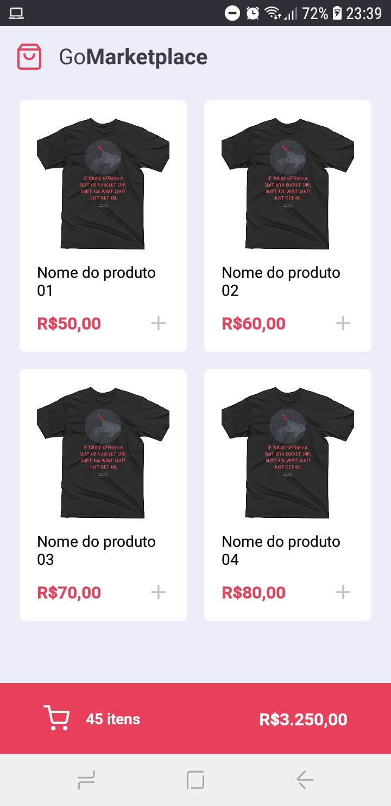
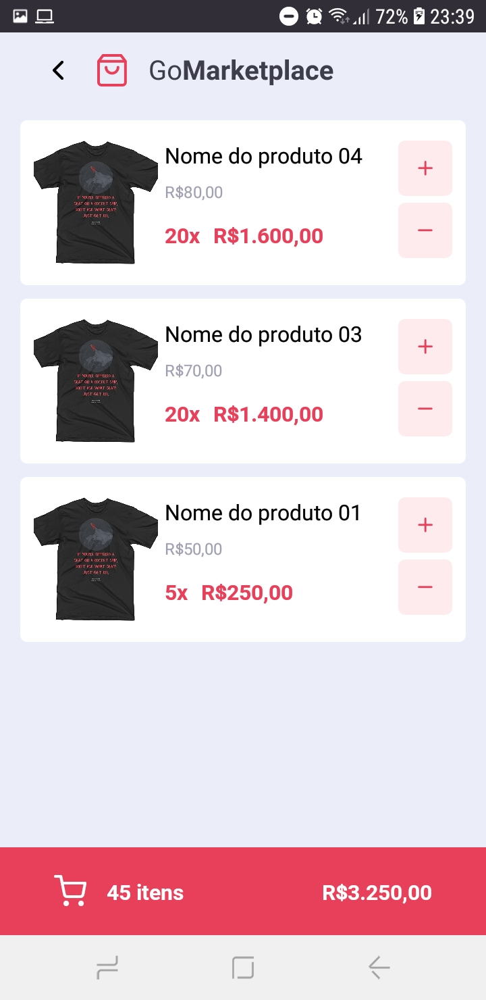

<h3 align="center">
  Desafio 08: Fundamentos do React Native
</h3>

“Não existe linha de chegada, a vitória está em se manter correndo”!</blockquote>

  

  

  

  

## :rocket: Sobre o desafio

Nesse desafio, desenvolverá uma nova aplicação, a GoMarketplace. Dessa vez é hora de você praticar o que você aprendeu até agora no React Native, junto com TypeScript, utilizando rotas, Async Storage e a Context API.

### Funcionalidades da aplicação

Agora que você já está com o template clonado e pronto para continuar, você deve verificar os arquivos da pasta `src` e completar onde não possui código, com o código para atingir os objetivos de cada rota.

- **`Listar os produtos da fake API`**: Sua página `Dashboard` deve ser capaz de exibir uma listagem através de uma tabela, com o campo `title`, `image_url` e `price`.

- **`Adicionar itens ao carrinho`**: Em toda sua aplicação, você deve utilizar o Contexto chamado `cart` que deixamos disponível. Você vai precisar completar as funcionalidades dentro de `hooks/cart.tsx` para que você consiga adicionar itens ao carrinho.

### Resultados

  
  

## :memo: Licença

Esse projeto está sob a licença MIT. Veja o arquivo [LICENSE](LICENSE) para mais detalhes.

---
